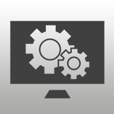

# Android DVB-T Driver

This driver provides a simple TCP based API that allows
controlling USB DVB-T/DVB-T2 tuners on Android. It gives other apps access to
the raw DVB MPEG-2 TS stream.

The driver is a simplified user space port of a subset of
the V4L2 Linux kernel drivers. Under the hood it uses Android USB Host API
with a small helper library that allows fast kernel controlled USB bulk transfers.

# Download

* [Download DVB-T Driver on Google Play](https://play.google.com/store/apps/details?id=info.martinmarinov.dvbdriver)
* [Download DVB-T Driver on Amazon](https://www.amazon.com/gp/mas/dl/android?p=info.martinmarinov.dvbdriver)
* Download latest pre-compiled APK from GitHub: [app-release.apk](https://github.com/martinmarinov/AndroidDvbDriver/releases/latest)

# Usage

The driver has an Activity that demonstrates direct connection to hardware
and allows dumping the raw DVB-T/T2 transport stream to a file.

A socket interface is built on top of that functionality to allow the driver
to be used by third party apps over TCP. If you want to use the driver via the
exposed TCP interface, you have to do the following steps from your own app:

1. Launch an android intent
```java
startActivityForResult(new Intent(Intent.ACTION_VIEW)
            .setData(new Uri.Builder().scheme("dtvdriver").build()), SOME_CODE);
```
1. If the activity returns successfully, you will receive two TCP port numbers to bind to.
One of them is the control port where you can send commands and receive responses.
The other port will provide the raw TS stream.
1. You can then start sending commands over the control port and process the TS stream.

For actual details on the protocol, take a look at the `dvbservice` module. There
are no official docs provided, if you would like to volunteer to write one get in touch with me.

There is also a handy "debug" mode that allows the driver to play the pre-recorded TS dumps
as if they are coming from a real device. This mode is extremely useful during development.

Note that this driver does not provide channel/programme scanning/playback capabilities or any transport stream processing.
If you would like to write an app for DVB playback, you have to implement all of these yourself.

# Auto start

The driver will emmit `info.martinmarinov.dvbdriver.DVB_DEVICE_ATTACHED` action when a compatible USB tuner has 
been connected to the Android device. You can use this intent to launch your application automatically.

# Supported hardware

Currently:
* RTL2832 with tuner chip R820t
* RTL2832 with tuner chip E4000
* RTL2832 with tuner chip R828D (DVB-T2 support for MN88473, MN88472, CXD2837ER & CXD2841ER devices)
* RTL2832 with tuner chip FC0012
* RTL2832 with tuner chip FC0013
* MyGica T230
* MyGica (Geniatech) T230C DVB-T/T2/C
* MyGica Pad TV Tuner PT360
* EVOLVEO XtraTV stick (Some unbranded Android DVB-T sticks)
* PCTV AndroiDTV (78e)
* Potentially other AF9035 dongles. If your dongle works let me know and I will add it to this list.

The driver is not limited to these devices only. If a device has a Linux kernel driver, then it probably could be ported.
If you have ported a driver for a device, get in touch with me so we can add it to the main driver.

# Apps that use the driver

* [Aerial TV](http://aerialtv.eu/)
* [DVBTTelevizor](https://play.google.com/store/apps/details?id=net.petrjanousek.DVBTTelevizor)

If you would like your app to appear here, open a GitHub issue and I will be happy to add it!

# Important advice

Google Play has very strict rules about apps that can be used to access any TV content. Make sure not to include any TV sceenshots or anything that looks like TV screenshots in your app listing. The description of your app should be very clear that your app does not bundle any content and content is provided by the end user.

Please keep in mind that even if you follow all of the above, your app may still get suspended. The above is just a friendly sugggestion from a developer that has already gone through the worst of this process. This is not official or legal advice.